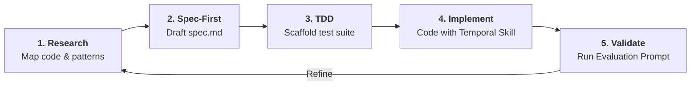
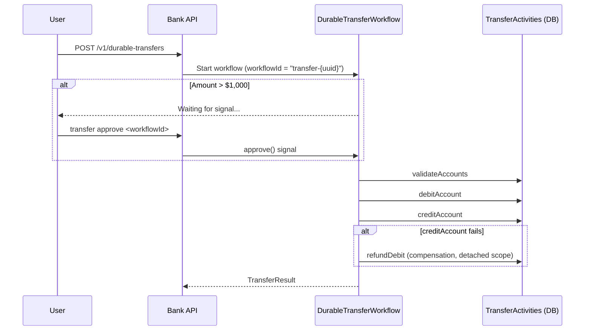

# Durable Transfer Quest: Building a Workflow with Temporal

Welcome to the **Durable Transfer Quest**! You will transform a standard bank transfer into a
robust, fault-tolerant **Workflow** using the Temporal Java SDK.

## The Agentic Workflow

In this module you are the **Architect** and the AI is your **Senior Engineer**. Follow this loop:



1. **Research:** Read `src/bank-api/` to understand the domain entities and service patterns.
2. **Spec-First:** Draft `src/temporal-worker/spec.md` from the [PRD](./PRD.md) before writing code.
3. **TDD:** The test file is pre-scaffolded — understand what each test asserts before implementing.
4. **Implement:** Use the [Official Temporal Developer Skill](https://github.com/temporalio/skill-temporal-developer).
5. **Validate:** Run the grading prompt in [GRADING_PROMPT.md](./GRADING_PROMPT.md).

## Prerequisites

- **Temporal Developer Skill:** Install the
  [official skill](https://github.com/temporalio/skill-temporal-developer) for your AI tool
  (Claude Code, Cursor, Copilot, etc.) before writing workflow or activity code.
- Infrastructure running: `make infra-up` (starts Postgres + Temporal server + Temporal UI).

---

## Architecture Overview



---

## Your Quests

Work through the quests in order. Each one builds on the previous.

---

### Quest 1: Agentic Setup — Prime Your AI Partner

Before writing code, give your AI agent the right context.

**Task:**
1. Install the [Temporal Developer Skill](https://github.com/temporalio/skill-temporal-developer)
   and add it to your tool's configuration file (`CLAUDE.md`, `.cursorrules`, etc.).
2. In that file, write a context block that:
   - Points to `src/bank-api/src/main/java/com/javatraining/bank/service/BankServiceImpl.java`
     for the established service/repository patterns.
   - Points to `src/bank-api/src/main/java/com/javatraining/bank/domain/` for domain entities.
   - Instructs the agent to **always use the Temporal Skill** for workflow and activity code.

**Definition of Done:**
Ask your agent: *"What service and repository patterns does this project use, and which Temporal
skill are we using?"* — it should answer accurately without extra prompting.

---

### Quest 2: Spec & Design — Contract-First

Write a technical specification **before** writing any code.

**Task:**
Create `src/temporal-worker/spec.md` covering:
- The workflow step-by-step logic (validation → approval gate → debit → credit → compensation).
- Input/output types for each activity.
- Which failures are retryable vs. non-retryable (and why).
- The idempotency strategy (workflow ID + activity-level `transferId` key).

**Definition of Done:**
- Your spec clearly maps each PRD acceptance criterion to a Temporal primitive.
- A reviewer can read the spec and predict exactly what the code will do.

---

### Quest 3: TDD — Understand the Test Suite

The test file is pre-scaffolded at:

```
src/temporal-worker/src/test/java/com/javatraining/bank/temporal/DurableTransferWorkflowTest.java
```

**Task:**
1. Read each `@Disabled` test and understand what it asserts.
2. Note the `TestWorkflowEnvironment` setup — no Temporal server needed; time is simulated.
3. Verify the tests compile (they do) but are skipped (they are — you haven't implemented the workflow yet).

```bash
./gradlew :src:temporal-worker:test --tests "*.DurableTransferWorkflowTest"
# Expected: 5 skipped, 0 failures
```

**Definition of Done:**
You can explain, in your own words, what each of the five tests validates.

---

### Quest 4: Implement the Workflow

**File:** `src/temporal-worker/src/main/java/com/javatraining/bank/temporal/impl/DurableTransferWorkflowImpl.java`

Use the Temporal Skill for this quest.

**Task:**
The file has five `TODO` markers. Implement them in order:

1. **Activity stub:** Create the `TransferActivities` stub with `ActivityOptions` (timeout + retry
   policy that excludes `ApplicationFailureException`).
2. **Validate:** Call `activities.validateAccounts(input)`.
3. **Approval gate:** Use `Workflow.await(Duration.ofHours(24), () -> approved || rejected)`.
   Fail with `ApplicationFailureException.newNonRetryableFailure` on timeout or rejection.
4. **Debit:** Call `activities.debitAccount(...)`.
5. **Credit + compensation:** Call `activities.creditAccount(...)` inside a `try/catch`. On failure,
   run `activities.refundDebit(...)` inside `Workflow.newDetachedCancellationScope(...)` so
   cancellation cannot abort the refund.

**Definition of Done:**
Remove `@Disabled` from the five tests one by one as you implement each path:

```bash
./gradlew :src:temporal-worker:test --tests "*.DurableTransferWorkflowTest"
# Target: 5 passed, 0 skipped, 0 failures
```

<details>
<summary>Hints</summary>

**Determinism — the cardinal rule**

Everything in `execute()` must be deterministic across replays. Never call `System.currentTimeMillis()`,
`new Random()`, or blocking I/O directly. Use the Temporal SDK equivalents:

```java
Workflow.currentTimeMillis()  // instead of System.currentTimeMillis()
Workflow.newRandom()          // instead of new Random()
Workflow.getLogger(...)       // instead of LoggerFactory.getLogger(...)
```

**Approval gate pattern**

```java
boolean signalReceived = Workflow.await(Duration.ofHours(24), () -> approved || rejected);
if (!signalReceived || rejected) {
    throw ApplicationFailureException.newNonRetryableFailure(
        "Transfer rejected or timed out", "REJECTED");
}
```

**Detached cancellation scope for compensation**

```java
try {
    activities.creditAccount(input.toAccountId(), input.amount(), input.transferId());
} catch (ActivityFailure e) {
    Workflow.newDetachedCancellationScope(
        () -> activities.refundDebit(
                  input.fromAccountId(), input.amount(), input.transferId()))
        .run();
    throw ApplicationFailureException.newNonRetryableFailure(
        "Credit failed; debit refunded", "COMPENSATED");
}
```

**Why detached scope?**

If the workflow receives an external cancellation signal while the credit has failed, the normal
cancellation scope would prevent the refund from running. A detached scope is immune to
cancellation — critical for compensation logic.

</details>

---

### Quest 5: Implement Idempotent Activities

**File:** `src/temporal-worker/src/main/java/com/javatraining/bank/temporal/activities/TransferActivitiesImpl.java`

Use the Temporal Skill for this quest.

**Task:**
The file has four `TODO` markers (one per activity). Implement each one:

1. Inject `BankService` (and optionally `TransactionRepository`) via constructor.
2. For each activity: **idempotency check first** — return early if a `Transaction` record with the
   given `transferId` already exists.
3. Apply the balance change using `BankService` methods (do not write SQL directly).
4. Wrap business-rule exceptions (`AccountNotFoundException`, `InsufficientFundsException`) in
   `ApplicationFailureException.newNonRetryableFailure(...)`.

**Definition of Done:**
Run the same activity twice with the same `transferId` — exactly one `Transaction` record exists.

<details>
<summary>Hints</summary>

**Idempotency check pattern**

```java
if (transactionRepository.existsByTransferIdAndType(transferId, TransactionType.DEBIT)) {
    log.info("Debit {} already applied — skipping (idempotent retry)", transferId);
    return;
}
```

**Non-retryable failure pattern**

```java
try {
    bankService.getAccount(accountId);
} catch (AccountNotFoundException ex) {
    throw ApplicationFailureException.newNonRetryableFailure(
        ex.getMessage(), "ACCOUNT_NOT_FOUND");
}
```

**Why non-retryable for business errors?**

If an account doesn't exist, retrying the activity 10 more times won't make it exist. Non-retryable
tells Temporal to surface the failure immediately rather than burning retries on a hopeless case.

</details>

---

### Quest 6: End-to-End Integration

Connect the workflow to the HTTP API and CLI.

**Task:**

**API** — `src/bank-api/src/main/java/com/javatraining/bank/controller/DurableTransferController.java`

The file has four `TODO` markers:
1. Add the `transfers:write` scope check (pattern: `TransferController`).
2. Build a `TransferInput` from the request, generating a fresh `transferId`.
3. Start the workflow with `workflowId = "transfer-" + transferId`.
4. Return `202 Accepted` with the `workflowId` in the body.

Also add a `POST /v1/durable-transfers/{workflowId}/signal/approve` endpoint that sends the
`approve()` signal. This is what the CLI calls.

**CLI** — `src/bank-cli/src/main/java/com/javatraining/bank/cli/TransferCommand.java`

The `Approve` subcommand has one `TODO`:
- POST to `/v1/durable-transfers/{workflowId}/signal/approve` with bearer token.
- Print a friendly message on 404 (workflow not found / already completed).

**Definition of Done:**

```bash
make infra-up && make db-migrate

# Terminal 1 — start worker
make run-worker

# Terminal 2 — start API
make run-bank-api

# Terminal 3 — issue token
export BANK_TOKEN=$(curl -s -X POST http://localhost:8080/v1/token \
  -H "Content-Type: application/json" \
  -d '{"userName":"alice","scopes":["transfers:write"]}' | jq -r '.token')

# Start a large transfer (needs approval)
curl -s -X POST http://localhost:8080/v1/durable-transfers \
  -H "Authorization: Bearer $BANK_TOKEN" \
  -H "Content-Type: application/json" \
  -d '{"fromAccountId":"00000000-0000-0000-0000-000000000001",
       "toAccountId":"00000000-0000-0000-0000-000000000002","amount":5000}'
# Expected: {"workflowId":"transfer-<uuid>"}

# Approve via CLI (use the workflowId from above)
./gradlew :src:bank-cli:run --args="transfer approve transfer-<uuid>"
```

Observe the workflow history in the [Temporal Web UI](http://localhost:8233).

---

### Quest 7: Production Hardening

**Task:**
1. **Worker registration:** Verify `WorkerConfig.java` registers both `DurableTransferWorkflowImpl`
   and `TransferActivitiesImpl` — the scaffold already does this. Confirm the worker appears in the
   Temporal Web UI.
2. **Structured logging:** Ensure activities use `log.info("message {}", param)` structured format.
   Confirm trace IDs appear in logs (Logback + Temporal SDK propagates them automatically).
3. **Idempotency crash test:** Kill the worker mid-activity (`Ctrl-C` during a `debitAccount`
   call). Restart the worker. Verify only one `Transaction` record exists in the database.
4. **Replay test (bonus):** Export a successful workflow history and write a replay test:

   ```bash
   temporal workflow show \
     --workflow-id transfer-<uuid> \
     --output json > src/temporal-worker/src/test/resources/transfer_history.json
   ```

   Then write a `ReplayTest` using `WorkflowReplayer.replayWorkflowExecution(...)` to verify the
   code handles the exported history without non-determinism errors.

**Definition of Done:**
- Worker registers cleanly; no errors in startup logs.
- No duplicate `Transaction` records after a simulated crash.

---

## Engineering Pro-Tips

**Use `Workflow.getLogger()` inside workflows**

```java
// WRONG — produces duplicate log lines during replay
private static final Logger log = LoggerFactory.getLogger(MyWorkflow.class);

// CORRECT — suppressed during replay
private static final Logger log = Workflow.getLogger(MyWorkflow.class);
```

**Never block in workflow code**

`Thread.sleep()`, synchronous HTTP calls, or JDBC access inside the workflow class will cause
undefined behaviour and may pin carrier threads. All I/O belongs in activities.

**`WorkflowClient.start()` vs `stub.execute()`**

`stub.execute(input)` blocks until the workflow completes. `WorkflowClient.start(stub::execute, input)`
returns immediately — use this in the API controller so the HTTP request returns `202` without
waiting for the transfer to finish.

---

## Self-Evaluation & Grading

Use the [GRADING_PROMPT.md](./GRADING_PROMPT.md) to perform a comprehensive audit once you've
finished all seven quests.

---

[← Back to Challenges Overview](../README.md)
